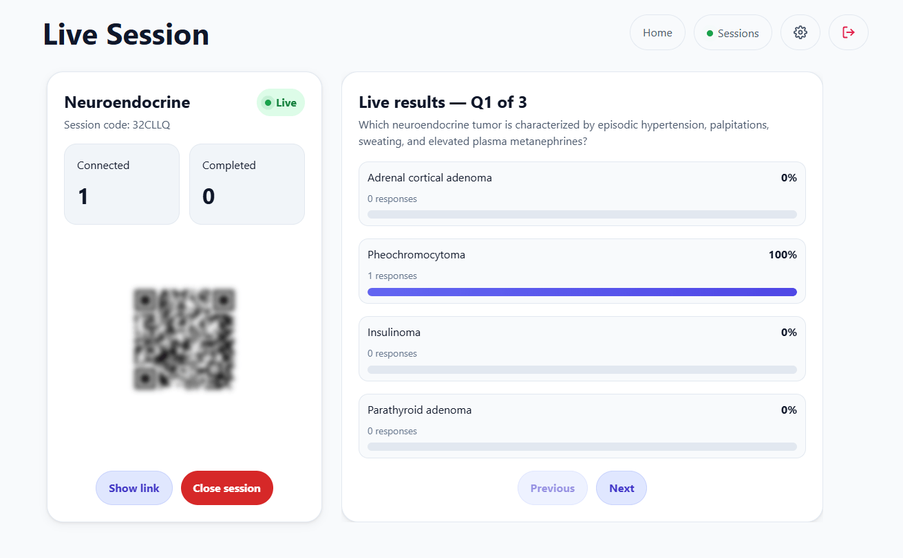
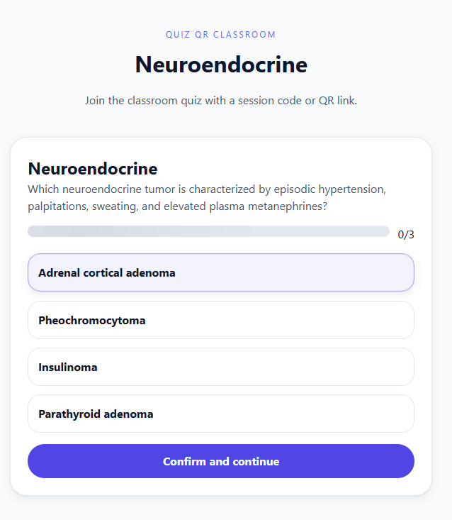
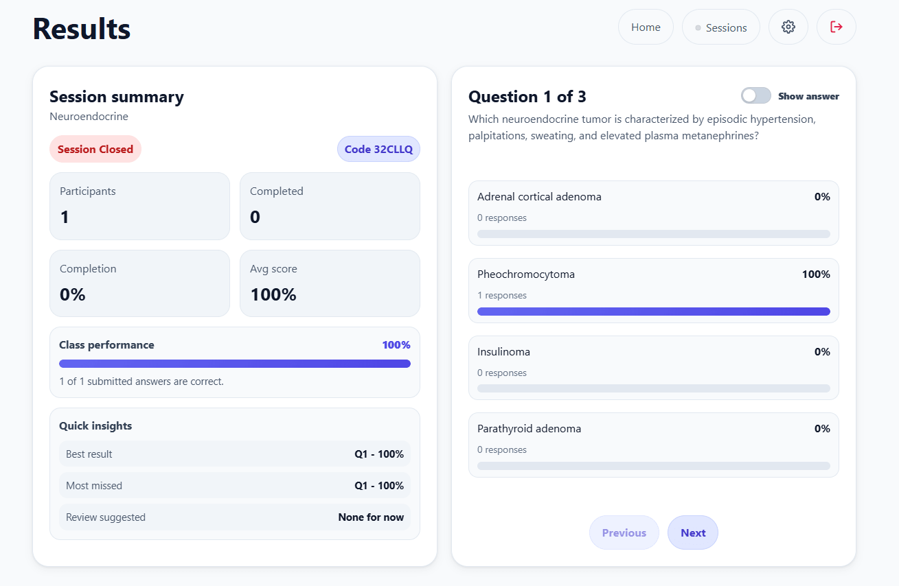
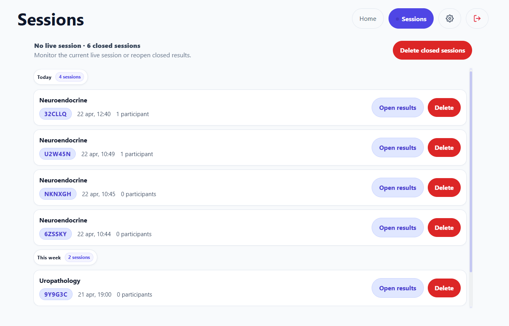
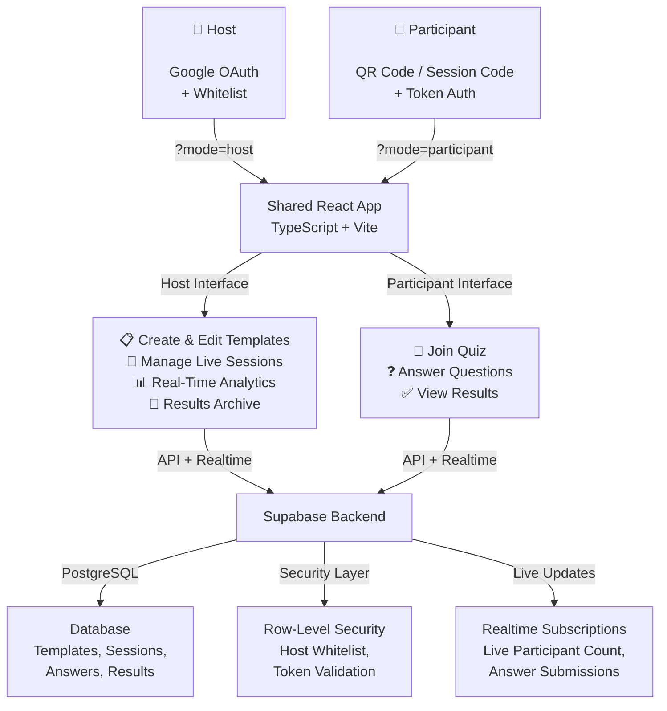

# QR Quiz — Real-Time Interactive Quiz Platform

<p align="center">
  
  
  
  
  
  
</p>

<p align="center">
  <strong>Live interactive quizzes and polls for any group — join with a QR code, answer in real-time, see results instantly.</strong>
</p>

<p align="center">
  <a href="https://liveqrquiz.org">🌐 liveqrquiz.org</a>
</p>

---

## What it does

QR Quiz lets a host run a live quiz session from any device and have participants join in seconds — no accounts, no app installs, just a QR code or a 6-character session code.

The host controls the pace: they open a session, share the code, and watch responses come in on a real-time analytics dashboard. Participants pick a nickname and avatar, answer each question, and see a completion screen when they're done. The moment a session closes, the full results are saved to an archive for later review.

---

## Screenshots

| Live Dashboard | Participant Quiz |
|:---:|:---:|
|  |  |
| QR code + real-time response breakdown per question | Clean, minimal answering interface |

| Closed Results | Session Archive |
|:---:|:---:|
|  |  |
| Final results and analytics after session closes | Full history of past sessions grouped by date |

---

## How it works

The app has two distinct interfaces that live at the same URL, selected by a query parameter (`?mode=host` or `?mode=participant`). The host's dashboard and the participant's quiz screen are two faces of the same codebase — no separate apps, no separate deploys.



### Session lifecycle

1. **Host creates a quiz** — builds a template with questions and multiple-choice options.
2. **Host opens a session** — the app generates a 6-character code and a QR code for participants to join.
3. **Participants join** — they scan the QR code (or type the code), pick a nickname and avatar, and start answering.
4. **Live dashboard** — the host sees participant count, per-question response distribution, and group average updating in real time via Supabase Realtime subscriptions.
5. **Session closes** — results are saved to the archive with a full breakdown. The template can be reused for future sessions.

### State as a URL

Every app state is encoded in the URL. A participant who closes their tab and comes back via the same link is automatically restored to where they left off — their token lives in both the URL and localStorage as a fallback. This makes the app refresh-safe and shareable without any login flow for participants.

### Gateway pattern

All data access goes through a single `AppGateway` interface. In production, it's backed by Supabase. In tests, an in-memory implementation replaces it entirely — no network, no database, no environment variables needed to run the full test suite. The UI is completely decoupled from the backend.

---

## Features

### Host side

- OAuth login with a host whitelist (not every account can access the dashboard)
- Create and edit quiz templates with any number of questions and options
- Local draft saving before publishing a template
- Generate QR codes and shareable links for each session
- Real-time dashboard with:
  - Live participant count and completion tracking
  - Per-question response breakdown (counts + percentages)
  - Correct answer highlighting
  - Group average and best/worst question detection
- Session archive grouped by date, with individual or bulk deletion
- Closed session results preserved permanently

### Participant side

- Join by scanning a QR code or typing a 6-character code
- Pick one of 9 avatars and enter a nickname
- Answer questions one at a time with a clear, minimal interface
- Automatic progress restoration on page refresh or return visit
- Graceful handling of sessions that don't exist or are already closed

---

## Architecture & key decisions

**No routing library.** App mode and session state come from URL query parameters. The routing is intentionally flat — no nested routes, no router configuration. Deep linking and browser navigation work naturally without any extra setup.

**Screen-based state machines.** The host interface moves through 8 explicit named stages (boot → setup → live → results → closed...). The participant interface has 6 screens. Each transition is intentional and typed — there's no implicit state drift between views.

**Anonymous participant participation.** Participants don't create accounts. When someone joins, the app generates a cryptographically random opaque token and stores it in the URL and localStorage. The database uses this token as the participant identity. No PII collected beyond a self-chosen nickname.

**Security enforced at the database layer.** Every table has Row-Level Security policies enforced by PostgreSQL. The host whitelist is a table, not an environment variable. The frontend assumes the database will reject anything it shouldn't allow — there's no duplicated access-control logic in the client.

**Unambiguous session codes.** The 6-character codes use only uppercase letters and digits that can't be visually confused: no `0/O`, no `1/I`. Generated via `crypto.getRandomValues()`.

**No UI framework.** The design system is hand-written CSS with custom properties — no Tailwind, no MUI, no Chakra. This keeps the bundle lean and the styling fully predictable.

---

## Tech stack

| Layer | Technology | Role |
|---|---|---|
| Frontend framework | React 19 | UI with hooks and functional components |
| Language | TypeScript 5.9 (strict) | End-to-end type safety |
| Build tool | Vite 8 | Dev server + production bundling |
| Database | Supabase / PostgreSQL | Persistent storage with Row-Level Security |
| Auth | Supabase Auth (Google OAuth) | Teacher authentication |
| Realtime | Supabase Realtime | Live result subscriptions |
| QR codes | qrcode.react | In-browser QR generation, no external service |
| Unit tests | Vitest + React Testing Library | 44 integration tests |
| E2E tests | Playwright | Full browser automation |

---

## Testing

The test suite covers the full application through integration tests, not isolated unit tests. Each test operates against the in-memory `TestGateway`, making the suite fast, deterministic, and free of any external dependencies.

Coverage includes:

- Auth flows (login, access denied, teacher whitelist check)
- Complete session lifecycle (create → open → live → close → archive)
- Student progression (join → answer → complete → restore from token)
- Workspace persistence across simulated page refreshes
- Draft management (save, discard, delete)

```
44 tests — all passing
```

---

## Security model

| Who | How they're identified | What they can do |
|---|---|---|
| Host | OAuth + whitelist table | Full CRUD on templates; open/close sessions; read all results |
| Participant | Opaque token | Read open sessions; submit answers (once per question); update own profile |
| Anonymous | Nothing | Check whether a session code is valid |

All policies are enforced by PostgreSQL RLS. A participant token cannot be used to read another participant's answers or submit answers twice for the same question — these constraints live at the database level, not in the frontend.

---

## License

MIT © 2026 Federico Cocuzza
